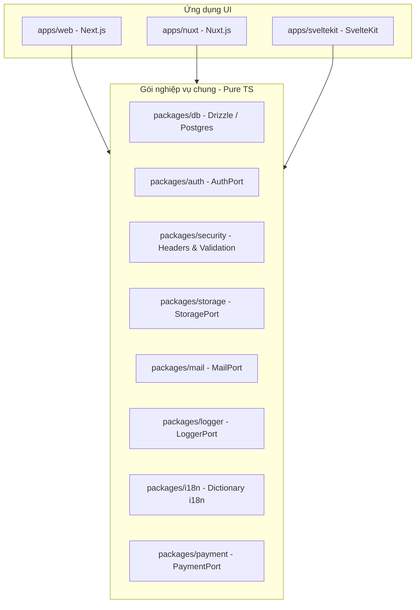

# Multi-Framework Integration Guide

Nhờ kiến trúc **Ports & Adapters** của Shipkit, tất cả các gói logic nghiệp vụ của hệ thống (`@shipkit/db`, `@shipkit/auth`, `@shipkit/security`, `@shipkit/mail`, `@shipkit/storage`, `@shipkit/logger`, `@shipkit/i18n`, `@shipkit/payment`) đều hoàn toàn **framework-agnostic** (độc lập với framework UI).

Điều này cho phép bạn dễ dàng tích hợp thêm bất kỳ UI framework nào chạy trên môi trường Node.js (như **Nuxt**, **SvelteKit**, **Remix**, **Astro** hoặc **TanStack Start**) vào cùng một monorepo mà không cần sửa đổi bất kỳ dòng mã infra nào.

---

## 🏗️ Kiến trúc Multi-Framework



---

## 🚀 Hướng dẫn tích hợp Nuxt.js làm ứng dụng thứ 2

Dưới đây là các bước để tích hợp ứng dụng Nuxt.js (`apps/nuxt`) vào Shipkit monorepo:

### Bước 1: Khởi tạo Nuxt App
Chạy lệnh khởi tạo Nuxt trong thư mục `apps/`:

```bash
cd apps
npx -y nuxi@latest init nuxt
```

### Bước 2: Khai báo Workspace Dependencies
Cập nhật `apps/nuxt/package.json` để liên kết đến các gói dùng chung trong monorepo:

```json
{
  "name": "@shipkit/nuxt-app",
  "private": true,
  "type": "module",
  "scripts": {
    "build": "nuxt build",
    "dev": "nuxt dev",
    "generate": "nuxt generate",
    "preview": "nuxt preview",
    "postinstall": "nuxt prepare"
  },
  "dependencies": {
    "@shipkit/db": "workspace:*",
    "@shipkit/auth": "workspace:*",
    "@shipkit/security": "workspace:*",
    "@shipkit/storage": "workspace:*",
    "@shipkit/mail": "workspace:*",
    "@shipkit/logger": "workspace:*",
    "@shipkit/i18n": "workspace:*",
    "nuxt": "^3.11.0"
  }
}
```

Chạy `pnpm install` từ thư mục gốc để liên kết các symlink cục bộ.

### Bước 3: Cấu hình TypeScript
Nuxt tự quản lý tsconfig thông qua tệp sinh tự động `.nuxt/tsconfig.json`. Cập nhật `apps/nuxt/tsconfig.json` của bạn để kế thừa đúng:

```json
{
  "extends": "./.nuxt/tsconfig.json"
}
```

### Bước 4: Khởi tạo các Service Resolvers trong Nuxt
Bạn có thể viết các resolvers cho Nuxt tương tự như Next.js. Ví dụ, tạo tệp `apps/nuxt/server/utils/services.ts`:

```typescript
import { getAuth } from "@/lib/auth"; // port adapter
import { getStorage } from "@/lib/storage";
import { getMailer } from "@/lib/mail";
import { getLogger } from "@shipkit/logger";

const logger = getLogger("nuxt/services");

export function useServices() {
  return {
    auth: getAuth(),
    storage: getStorage(),
    mail: getMailer(),
    logger,
  };
}
```

### Bước 5: Cấu hình Biến môi trường (Environment Variables)
Nuxt sử dụng hệ thống cấu hình `runtimeConfig` thay vì chỉ đọc `process.env`. Trong `apps/nuxt/nuxt.config.ts`, bạn có thể map các biến môi trường của hệ thống:

```typescript
export default defineNuxtConfig({
  runtimeConfig: {
    // Chỉ khả dụng ở phía Server
    databaseUrl: process.env.DATABASE_URL,
    betterAuthSecret: process.env.BETTER_AUTH_SECRET,
    resendApiKey: process.env.RESEND_API_KEY,
    s3Bucket: process.env.S3_BUCKET,

    // Khả dụng ở cả Client và Server
    public: {
      appUrl: process.env.NEXT_PUBLIC_APP_URL || 'http://localhost:3000',
    }
  }
});
```

---

## ⚡ Điểm cần lưu ý khi phát triển ứng dụng khác
1. **Authentication Session**: Nếu bạn chạy cả hai ứng dụng (`apps/web` và `apps/nuxt`) trên cùng một tên miền chính (ví dụ `app.yoursite.com` và `blog.yoursite.com`), hãy cấu hình cookies của Better Auth hoặc Supabase với thuộc tính `domain: ".yoursite.com"` để chia sẻ phiên đăng nhập mượt mà.
2. **CORS**: Nếu hai ứng dụng gọi API chéo của nhau, hãy cấu hình whitelist CORS của các endpoints bằng cách sử dụng `@shipkit/security` để đảm bảo an toàn.
